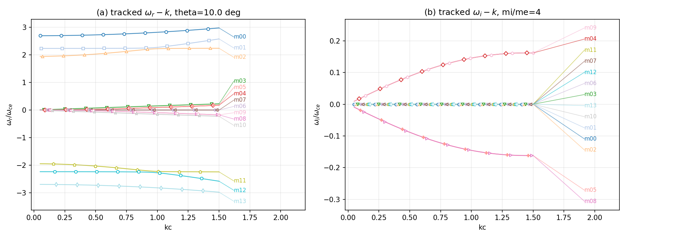
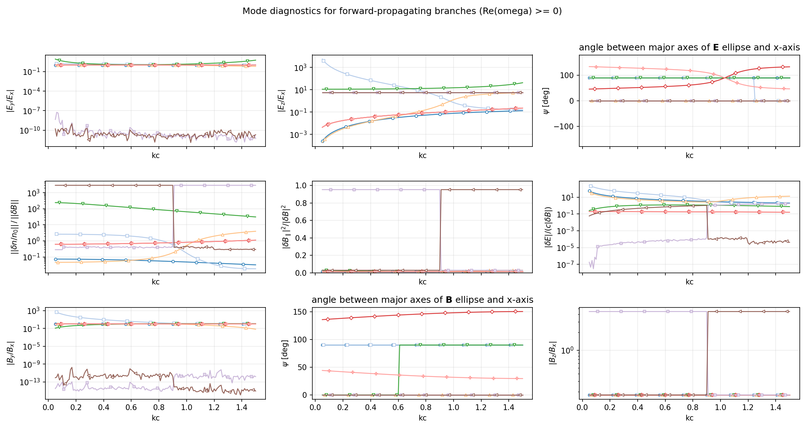
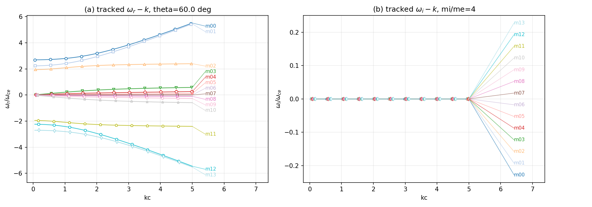
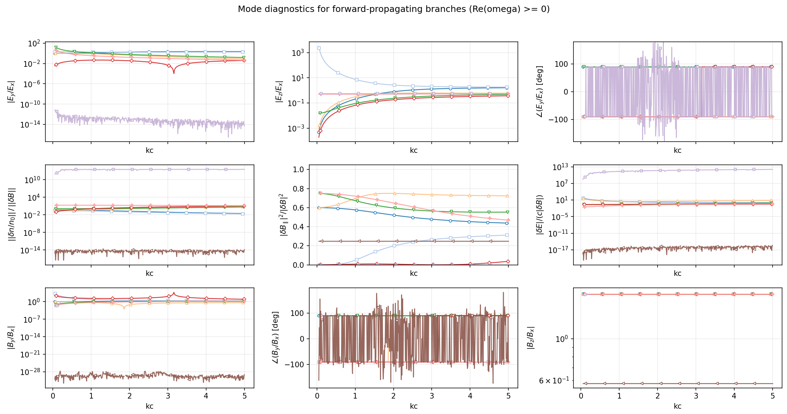

# **RAMSES-Py (Relativistic Anisotropic Multi-Fluid Solver for Eigenmodes in Python)**
RAMSES-Py is a Python-based extension of the original MATLAB version of **PDRF**,developed for plasma wave analysis and mode diagnosis.  
Built upon the core framework of PDRF, RAMSES-Py introduces several new capabilities, including:

- analysis of **polarization relations under eigenvalue perturbation**,
- **simultaneous identification and classification of multiple wave branches**,
- extended post-processing and diagnostic tools,
- and example-based workflows for practical case studies.

The goal of this project is to provide a more flexible, extensible, and user-friendly platform for dispersion-relation analysis in magnetized plasmas.

version 1.0, 2026-03-11, Xie Haoen and He Jiansen.

reference: 
Computer Physics Communications 185 (2014) 670–675,
Xie Huasheng,
PDRF: A general dispersion relation solver for magnetized multi-fluid plasma.
doi: https://doi.org/10.1016/j.cpc.2013.10.012

# example1：firehose instablity

setting parameters:

 q,      m,      n0,    v0x,  v0y,  v0z,  csz,   csp,  epsnx, epsny
 
-1.0    1.0     4.0     0.0   0.0   0.0   0.02   0.02   0.0    0.0
 
 1.0    4.0     4.0     0.0   0.0   0.0   0.35   0.10   0.0    0.0
 
 kmin=0.05, kmax=1.5, dk=0.05, theta=10 degree
 
## dispersion relation figure:

## polarization relations under eigenvalue perturbation figure:

# example2：isotropic oblique waves

setting parameters:
 
 q,      m,      n0,    v0x,  v0y,  v0z,  csz,   csp,  epsnx, epsny

-1.0    1.0     4.0     0.0   0.0   0.0   0.10   0.10   0.0    0.0

 1.0    4.0     4.0     0.0   0.0   0.0   0.10   0.10   0.0    0.0
 
 kmin=0.05, kmax=5, dk=0.05, theta=60 degree

## dispersion relation figure:

## polarization relations under eigenvalue perturbation figure:

